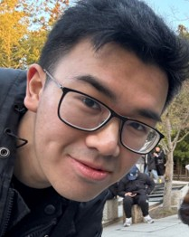
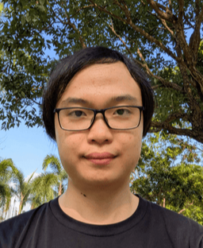
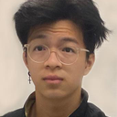
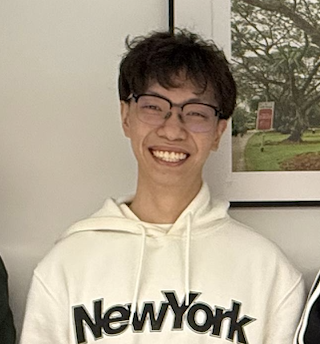

# About Us

We are a team based in the [School of Computing, National University of Singapore](http://www.comp.nus.edu.sg).

You can reach us at the email `seer[at]comp.nus.edu.sg`

## Project team

### Jason Lim

[[github](https://github.com/rizrn)]
[[portfolio](team/rizrn.md)]

* Role: Developer
* Responsibilities: Integration & Testing

### Cai Zhouxuan

[[github](http://github.com/CZX123)]
[[portfolio](team/czx123.md)]

* Role: Developer
* Responsibilities: Contact logic commands

### Yi Jie

[[github](http://github.com/ywijie)] [[portfolio](team/ywijie.md)]

* Role: Developer
* Responsibilities: UI and  Feature implementation

### Darien Tan

[[github](http://github.com/reven0n)]
[[portfolio](team/reven0n.md)]

* Role: Developer
* Responsibilities: Contact Logic Commands

### Zibin

[[github](http://github.com/asaiyume)]
[[portfolio](team/asaiyume.md)]

* Role: Developer
* Responsibilities: Models & Abstraction, Documentation, Code Quality
