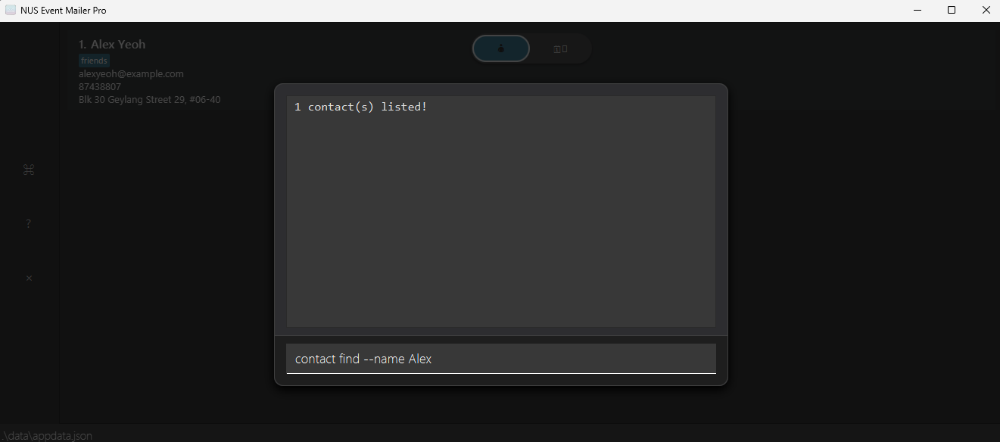
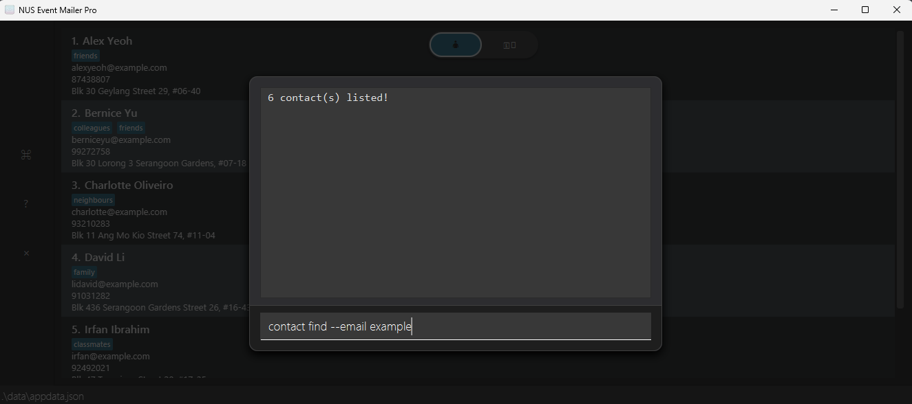
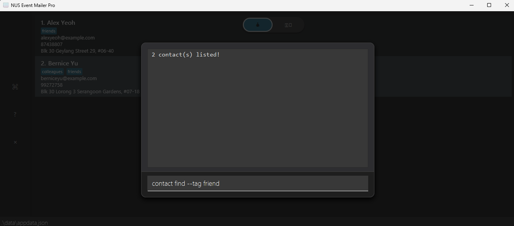
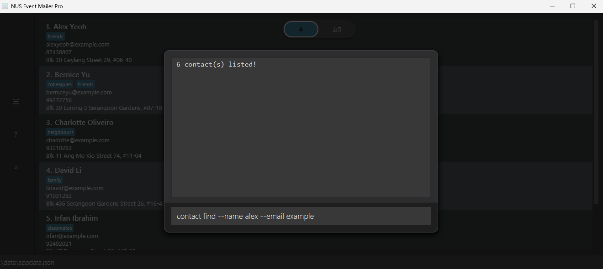

# NUS Event Mailer Pro User Guide

NUS Event Mailer Pro (NUS EMP) is a **desktop app that helps you manage hundreds of events and contacts** quickly and easily. It's designed for speed and simplicity, as most actions can be done by typing commands directly, allowing you to work quickly without relying on menus or complex navigation. Event Mailer Pro keeps your workflow smooth, so you can focus on running great events, not managing data.

<!-- * Table of Contents -->
<page-nav-print />

---

## Quick start

1. Ensure you have Java `17` or above installed in your Computer.<br>
   **Mac users:** Ensure you have the precise JDK version prescribed [here](https://se-education.org/guides/tutorials/javaInstallationMac.html).

1. Download the latest `.jar` file from [here](https://github.com/AY2526S1-CS2103T-F15b-2/tp/releases).

1. Copy the file to the folder you want to use as the _home folder_ for NUS EMP.

1. Open a command terminal, `cd` into the folder you put the jar file in, and use the `java -jar nus-emp.jar` command to run the application.<br>
   A GUI similar to the below should appear in a few seconds. Note how the app contains some sample data.<br>
   

1. Type the command in the command box (Opened with CTRL-T or the "⌘" button on the sidebar) and press Enter to execute it.
<br />  e.g. typing **`help`** and pressing Enter will open the User Guide in your default browser.<br>
   Some example commands you can try:

   - `contact list` : Lists all contacts.

   - `contact add --name John Doe --email johnd@example.com` : Adds a contact named `John Doe`.

   - `contact delete 3` : Deletes the 3rd contact shown in the contact list.

   - `event add --name Meeting --date 25-12-2025 14:30` : Adds an event named `Meeting`.

   - `event list` : Lists all events.

   - `event link --contact 2 --event 1` : Links the 2nd contact in the contact list to the 1st event in the event list.

   - `exit` : Exits the app.

1. Refer to the [Features](#features) below for details of each command.

---

## Command Format Notations

<box type="info" seamless>

- Words in `UPPER_CASE` are the parameters to be supplied by the user.<br>
  e.g. in `contact add --name NAME`, `NAME` is a parameter which can be used as `contact add --name John Doe`.

- Items in square brackets are optional.<br>
  e.g `--name NAME [--tag TAG]` can be used as `--name John Doe --tag friend` or as `--name John Doe`.

- Items with `…` after them can be used multiple times including zero times.<br>
  e.g. `[--tag TAG]…` can be used as ` ` (i.e. 0 times), `--tag friend`, `--tag friend --tag family` etc.

- Parameters can be in any order.<br>
  e.g. if the command specifies `--name NAME --email EMAIL`, `--email EMAIL --name NAME` is also acceptable.

- Extraneous parameters for commands that do not take in parameters (such as `help` and `exit`) will be ignored.<br>
  e.g. if the command specifies `help 123`, it will be interpreted as `help`.

- If you are using a PDF version of this document, be careful when copying and pasting commands that span multiple lines as space characters surrounding line-breaks may be omitted when copied over to the application.
  </box>

---

## Features

### Viewing help: `help`

Opens the User Guide in your default browser.
<br/>Clicking the "?" button on the sidebar will also open the User Guide in your browser.

**Format**: `help`

---

### Managing contacts: `contact`

#### Adding a contact: `contact add`

Adds a contact to the contact list.

**Format**: `contact add --name NAME --email EMAIL [--phone PHONE_NUMBER] [--address ADDRESS] [--tag TAG]…`

**Examples**:
```
contact add --name John Doe --email johnd@example.com
```
- Adds a contact with the name `John Doe` and email `johnd@example.com`.
```
contact add --name Betsy Crowe --tag friend --email betsycrowe@example.com --address NUS --phone 12345678 --tag colleague
```
- Adds a contact with the name `Betsy Crowe` and email `betsycrowe@example.com` with a tag, address and phone number.
> Tip: Fields can be specified in any order, but only `--tag` can be specified multiple times.


#### Listing all contacts: `contact list`

Shows a list of all contacts in the contact list.

**Format**: `contact list`

#### Editing a contact: `contact edit`

Edits an existing contact in the contact list.

**Format**: `contact edit INDEX [--name NAME] [--email EMAIL] [--phone PHONE_NUMBER] [--address ADDRESS] [--tag TAG]…`

- Edits the contact at the specified `INDEX`.
- Replaces any existing values with the new values given. e.g. if the contact being edited has phone number `12345678`, and the command specifies `--phone 87654321`, the phone number will be changed to `87654321`.
- At least one field to edit must be provided.

<box type="tip" seamless>

 **Tips on editing contacts:**
- You can find the index of the contact in the displayed contact list. The index should be a positive integer.
- You can specify an empty string to clear any optional field. e.g. `contact edit 1 --phone` clears the phone number of the first contact. Note that a contact's name and email cannot be cleared.
- Likewise, you can remove all the contact's tags by typing `--tag` without specifying any tags after it.

</box>

**Examples**:

```
contact edit 1 --phone 91234567 --email johndoe@example.com
```
  - Edits the phone number and email address of the 1st contact to be `91234567` and `johndoe@example.com` respectively.
```
contact edit 2 --name Betsy Crower --phone --tag
```
  - Edits the name of the 2nd contact to be `Betsy Crower`, removes the phone number and clears all existing tags.

#### Finding contacts: `contact find`

Finds contacts whose fields contain any of the given keywords.

**Format**: `contact find KEYWORD [MORE_KEYWORDS]...` or `contact find [--FIELD KEYWORD [MORE_KEYWORDS]...]...`

where `FIELD` is one of: `name`, `email`, `phone`, `address`, `tag`

At least one parameter must be provided.

<box type="info" seamless>

**Understanding the search behavior:**

- The search is **case-insensitive**. e.g. `hans` will match `Hans`, `HANS`, or `HaNs`
- **All fields** support partial matches. e.g. `han` will match `Hans`, `gmail` will match `user@gmail.com`
- **Within each field**: OR logic applies - contacts matching **any** keyword will be returned
  - e.g. `--name alice bob` matches contacts with "alice" OR "bob" in their name
- **Between different fields**: AND logic applies - contacts must match **all** specified fields
  - e.g. `--name alice --email gmail` matches contacts with "alice" in name AND "gmail" in email

</box>

**Two ways to search:**

1. **Simple name search** (backward compatible):

   - Format: `contact find KEYWORD [MORE_KEYWORDS]...`
   - Searches only in contact names
   - Example: `contact find John` returns contacts with "John" in their name

2. **Advanced search with field filters**:
   - Format: `contact find [--FIELD KEYWORD [MORE_KEYWORDS]...]...`
   - You can search by name, email, phone, address, and/or tags
   - Use one or more filters in any combination

**Examples**:
```
contact find John
```
  - Finds contacts whose names contain the word `John`
  - Returns: `John Doe`, `John Smith`

  
```
contact find alex david
```
  - Finds contacts whose names contain `Alex` OR `David`
  - Returns: `Alex Yeoh`, `David Li`
```
contact find --email gmail
```

  - Finds contacts whose email addresses contain `gmail`
  - Returns contacts with emails like `alex@gmail.com`, `user.name@gmail.com`

  

```
contact find --phone 9123
```

  - Finds contacts whose phone numbers contain `9123`
  - Returns contacts with phone numbers like `91234567`, `81239999`

```
contact find --address serangoon
```

  - Finds contacts whose addresses contain `serangoon`
  - Returns contacts with addresses like `Blk 123 Serangoon North`, `Serangoon Gardens`

```
contact find --tag friend
```

  - Finds contacts with tags containing `friend`
  - Returns contacts tagged with `friend`, `friends`, `best-friend`, etc.

  

```
contact find --name alice bob --email nus.edu ntu.edu
```

  - Finds contacts where name contains (`alice` OR `bob`) AND email contains (`nus.edu` OR `ntu.edu`)
  - Matches: `Alice Tan` with `alice@nus.edu`, `Bob Lee` with `bob@ntu.edu`
  - Does NOT match: `Alice Tan` with `alice@gmail.com` (name matches but email doesn't)
  - Does NOT match: `Charlie Ng` with `charlie@nus.edu` (email matches but name doesn't)

  

```
contact find --name John --email gmail --tag colleague
```

  - Finds contacts where ALL of the following are true:
    - Name contains `John`, AND
    - Email contains `gmail`, AND
    - Has tag containing `colleague`
  - This narrows your search to very specific matches
  - Only returns contacts that satisfy all three conditions

  

<box type="tip" seamless>

**Tips for effective searching:**

- Use **simple name search** when you only need to find someone by name quickly
- Use **`--email`** to find all contacts from a specific domain (e.g., `--email company.com`)
- Use **`--phone`** to find contacts with specific phone number patterns (e.g., `--phone 9123`)
- Use **`--address`** to find contacts in a specific area (e.g., `--address tampines`, `--address jurong`)
- Use **`--tag`** to find all contacts in a category (e.g., `--tag client`, `--tag vendor`)
- **Combine multiple filters** to narrow down your search to very specific contacts
- **Use multiple keywords within a field** to broaden matches within that field (e.g., `--email nus.edu ntu.edu` finds emails from either domain)

</box>

#### Deleting a contact: `contact delete`

Deletes the specified contact from the contact list.

Format: `contact delete INDEX`

- The index refers to the index number shown in the displayed contact list. It should be a positive integer.

Examples:

```
contact list
contact delete 2`
```
- Deletes the 2nd contact in the full contact list.
```
contact find Betsy
contact delete 1
```
- Deletes the 1st contact in the results of the `contact find` command.

#### Showing events in contact: `contact show`

Shows all the events that the specified contact is part of.

Format: `contact show INDEX`

- The index refers to the index number shown in the displayed contact list. It should be a positive integer.

Examples:

```
event link --event 1 --contact 2
contact show 2
```
- Shows only the 1st event in the full event list.

---

### Managing events: `event`

#### Adding an event: `event add`

Adds an event to the event list.

**Format**: `event add --name NAME --date DATE [--address ADDRESS]`

* `DATE` should be in the format `DD-MM-YYYY HH:MM` (24-hour format)

**Examples**:
```
event add --name Meeting --date 25-12-2025 14:30 --address Meeting Room 4
```
```
event add --name Team Lunch --date 01-01-2026 12:00
```

#### Listing all events: `event list`

Shows a list of all events in the event list.

**Format**: `event list`

#### Linking contacts to events: `event link`

Links a contact to an event, allowing you to associate participants with specific events.

**Format**: `event link --event EVENT_INDEX --contact CONTACT_INDEX`

* `EVENT_INDEX` refers to the index number shown in the displayed event list
* `CONTACT_INDEX` refers to the index number shown in the displayed contact list

**Examples**:
```
event list
contact list
event link --event 1 --contact 2
```
- Links the 2nd contact to the 1st event.

#### Show contacts in event: `event show`

Shows all the contacts that are part of the specified event.

Format: `event show INDEX`

- The index refers to the index number shown in the displayed event list. It should be a positive integer.

Examples:

- `event link --event 1 --contact 2` followed by `event show 1` shows only the 2nd contact in the full contact list.

#### Exporting contacts belonging to an event: `event export`


Exports all contacts that are attending the event into your clipboard, allowing you to easily paste them into an email.
Clicking the button with the file icon located on the right of each event card will also copy the contacts into the clipboard.


**Format**: `event export INDEX`

* `INDEX` refers to the index number shown in the displayed event list

**Examples**:
```
event export 1
```
- Exports all contacts linked to the 1st event into your clipboard.


---

### Exiting the program: `exit`

Exits the program.

Format: `exit`

---

### Managing storage data

#### Saving the data

NUS EMP data are saved in the hard disk automatically after every command. There is no need to save manually.

#### Editing the data file

NUS EMP data are saved automatically as a JSON file `[JAR file location]/data/appdata.json`. Advanced users are welcome to update data directly by editing that data file.

<box type="warning" seamless>

**Caution:**
If your changes to the data file makes its format invalid, NUS EMP will discard all data and start with an empty data file at the next run. Hence, it is recommended to take a backup of the file before editing it.<br>
Furthermore, certain edits can cause the NUS EMP to behave in unexpected ways (e.g., if a value entered is outside the acceptable range). Therefore, edit the data file only if you are confident that you can update it correctly.

</box>

_Details coming soon ..._

---

## FAQ

**Q**: How do I transfer my data to another Computer?<br>
**A**: Install the app in the other computer and overwrite the empty data file it creates with the file that contains the data of your previous NUS EMP home folder.

---

## Known issues

1. **When using multiple screens**, if you move the application to a secondary screen, and later switch to using only the primary screen, the GUI will open off-screen. The remedy is to delete the `preferences.json` file created by the application before running the application again.
2. **If you minimize the Help Window** and then run the `help` command (or use the `Help` menu, or the keyboard shortcut `F1`) again, the original Help Window will remain minimized, and no new Help Window will appear. The remedy is to manually restore the minimized Help Window.

---

## Command summary

### General commands

| Action   | Format |
| -------- | ------ |
| **Help** | `help` |
| **Exit** | `exit` |

### Contact commands

| Action     | Format, Examples                                                                                                                                                                                                                                                                                              |
| ---------- |---------------------------------------------------------------------------------------------------------------------------------------------------------------------------------------------------------------------------------------------------------------------------------------------------------------|
| **Add**    | `contact add --name NAME --email EMAIL [--phone PHONE_NUMBER] [--address ADDRESS] [--tag TAG]…`<br>e.g. `contact add --name James --email james@e.com --phone 91234567 --address Work --tag friend --tag colleague`                                                                                           |
| **Delete** | `contact delete INDEX`<br> e.g. `contact delete 3`                                                                                                                                                                                                                                                            |
| **Edit**   | `contact edit INDEX [--name NAME] [--email EMAIL] [--phone PHONE_NUMBER] [--address ADDRESS] [--tag TAG]…`<br> e.g. `contact edit 2 --name James Lee --email jameslee@example.com`                                                                                                                            |
| **Find**   | `contact find KEYWORD [MORE_KEYWORDS]...`<br>e.g. `contact find James`<br><br>`contact find [--FIELD KEYWORD [MORE_KEYWORDS]...]...`<br>where FIELD is one of: name, email, phone, address, tag<br>e.g. `contact find --email gmail`<br>e.g. `contact find --phone 9123`<br>e.g. `contact find --address serangoon`<br>e.g. `contact find --name John --email company.com` |
| **List**   | `contact list`                                                                                                                                                                                                                                                                                                |
| **Show**   | `contact show INDEX`<br> e.g. `contact show 1`                                                                                                                                                                                                                                                                |

### Event commands

| Action     | Format, Examples                                                                                                                            |
|------------|---------------------------------------------------------------------------------------------------------------------------------------------|
| **Add**    | `event add --name NAME --date DATE [--address ADDRESS]`<br>e.g. `event add --name Meeting --date 25-12-2025 14:30 --address Meeting Room 4` |
| **List**   | `event list`                                                                                                                                |
| **Link**   | `event link --event EVENT_INDEX --contact CONTACT_INDEX`<br>e.g. `event link --event 1 --contact 2`                                         |
| **Show** | `event show INDEX`<br>e.g. `event show 1` |
| **Export** | `event export INDEX` <br>e.g. `event export 1`                                                                                                     |

