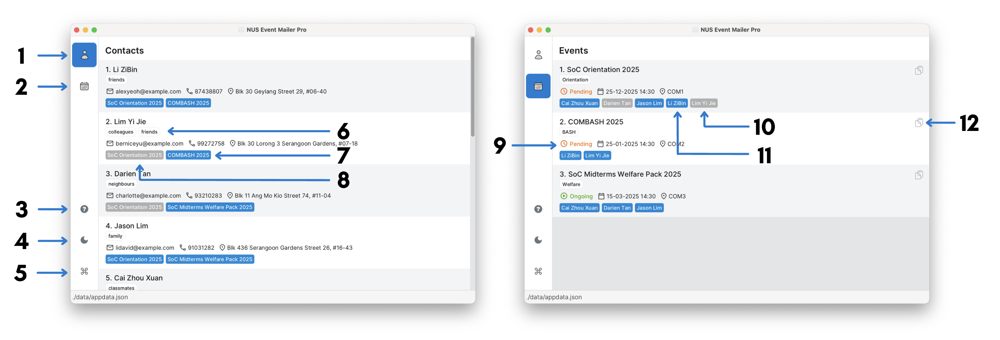

# NUS Event Mailer Pro User Guide

NUS Event Mailer Pro (NUS EMP) is a **desktop app that helps you manage hundreds of events and contacts** quickly and easily. It's designed for speed and simplicity, as most actions can be done by typing commands directly, allowing you to work quickly without relying on menus or complex navigation. Event Mailer Pro keeps your workflow smooth, so you can focus on running great events, not managing data.

<!-- * Table of Contents -->
<page-nav-print />

--------------------------------------------------------------------------------------------------------------------

## Quick start

1. Ensure you have Java `17` or above installed in your Computer. 
   **Mac users:** Ensure you have the precise JDK version prescribed [here](https://se-education.org/guides/tutorials/javaInstallationMac.html).

1. Download the latest `.jar` file from [here](https://github.com/se-edu/addressbook-level3/releases).

1. Copy the file to the folder you want to use as the _home folder_ for NUS EMP.

1. Open a command terminal, `cd` into the folder you put the jar file in, and use the `java -jar nus-emp.jar` command to run the application. 
   A GUI similar to the below should appear in a few seconds. Note how the app contains some sample data. 
   

1. Type the command in the command box and press Enter to execute it. e.g. typing **`help`** and pressing Enter will open the help window. 
   Some example commands you can try:

   * `contact list` : Lists all contacts.

   * `contact add --name John Doe --email johnd@example.com` : Adds a contact named `John Doe`.

   * `contact delete 3` : Deletes the 3rd contact shown in the contact list.

   * `event add --name Meeting --date 25-12-2025 14:30` : Adds an event named `Meeting`.

   * `event list` : Lists all events.

   * `event link --contact 2 --event 1` : Links the 2nd contact in the contact list to the 1st event in the event list.

   * `exit` : Exits the app.

1. Refer to the [Features](#features) below for details of each command.

--------------------------------------------------------------------------------------------------------------------

## Command Format Notations

<box type="info" seamless>

* Words in `UPPER_CASE` are the parameters to be supplied by the user. 
  e.g. in `contact add --name NAME`, `NAME` is a parameter which can be used as `contact add --name John Doe`.

* Items in square brackets are optional. 
  e.g `--name NAME [--tag TAG]` can be used as `--name John Doe --tag friend` or as `--name John Doe`.

* Items with `…` after them can be used multiple times including zero times. 
  e.g. `[--tag TAG]…` can be used as ` ` (i.e. 0 times), `--tag friend`, `--tag friend --tag family` etc.

* Parameters can be in any order. 
  e.g. if the command specifies `--name NAME --email EMAIL`, `--email EMAIL --name NAME` is also acceptable.

* Extraneous parameters for commands that do not take in parameters (such as `help` and `exit`) will be ignored. 
  e.g. if the command specifies `help 123`, it will be interpreted as `help`.

* If you are using a PDF version of this document, be careful when copying and pasting commands that span multiple lines as space characters surrounding line-breaks may be omitted when copied over to the application.
</box>

--------------------------------------------------------------------------------------------------------------------

## Features

### Viewing help: `help`

Shows a message explaining how to access the help page.

**Format**: `help`

---

### Managing contacts: `contact`

#### Adding a contact: `contact add`

Adds a contact to the contact list.

**Format**: `contact add --name NAME --email EMAIL [--phone PHONE_NUMBER] [--address ADDRESS] [--tag TAG]…`

**Examples**:
* `contact add --name John Doe --email johnd@example.com`
* `contact add --name Betsy Crowe --tag friend --email betsycrowe@example.com --address NUS --phone 12345678 --tag colleague`

#### Listing all contacts: `contact list`

Shows a list of all contacts in the contact list.

**Format**: `contact list`

#### Editing a contact: `contact edit`

Edits an existing contact in the contact list.

**Format**: `contact edit INDEX [--name NAME] [--email EMAIL] [--phone PHONE_NUMBER] [--address ADDRESS] [--tag TAG]…`

* Edits the contact at the specified `INDEX`.
* Replaces any existing values with the new values given. e.g. if the contact being edited has phone number `12345678`, and the command specifies `--phone 87654321`, the phone number will be changed to `87654321`.
* At least one field to edit must be provided.

<box type="tip" seamless>

**Tips on editing contacts:**

* You can find the index of the contact in the displayed contact list. The index should be a positive integer.
* You can specify an empty string to clear any optional field. e.g. `contact edit 1 --phone` clears the phone number of the first contact. Note that a contact's name and email cannot be cleared.
* Likewise, you can remove all the contact's tags by typing `--tag` without specifying any tags after it.

</box>

**Examples**:
*  `contact edit 1 --phone 91234567 --email johndoe@example.com`
   * Edits the phone number and email address of the 1st contact to be `91234567` and `johndoe@example.com` respectively.
*  `contact edit 2 --name Betsy Crower --phone --tag`
   * Edits the name of the 2nd contact to be `Betsy Crower`, removes the phone number and clears all existing tags.

#### Finding contacts by name: `contact find`

Finds contacts whose names contain any of the given keywords.

Format: `contact find KEYWORD [MORE_KEYWORDS]`

* The search is case-insensitive. e.g. `hans` will match `Hans`
* The order of the keywords does not matter. e.g. `Hans Bo` will match `Bo Hans`
* Only the name is searched.
* Only full words will be matched e.g. `Han` will not match `Hans`
* Persons matching at least one keyword will be returned (i.e. `OR` search).
  e.g. `Hans Bo` will return `Hans Gruber`, `Bo Yang`

Examples:
* `contact find John` returns `john` and `John Doe`
* `contact find alex david` returns `Alex Yeoh`, `David Li`

#### Deleting a contact: `contact delete`

Deletes the specified contact from the contact list.

Format: `contact delete INDEX`

* The index refers to the index number shown in the displayed contact list. It should be a positive integer.

Examples:
* `contact list` followed by `contact delete 2` deletes the 2nd contact in the full contact list.
* `contact find Betsy` followed by `contact delete 1` deletes the 1st contact in the results of the `contact find` command.

---

### Managing events: `event`

<!-- TODO: Add event command formats and usages -->
Details coming soon ...

---

### Exiting the program: `exit`

Exits the program.

Format: `exit`

---

### Managing storage data

#### Saving the data

NUS EMP data are saved in the hard disk automatically after every command. There is no need to save manually.

#### Editing the data file

NUS EMP data are saved automatically as a JSON file `[JAR file location]/data/addressbook.json`. Advanced users are welcome to update data directly by editing that data file.

<box type="warning" seamless>

**Caution:**
If your changes to the data file makes its format invalid, NUS EMP will discard all data and start with an empty data file at the next run.  Hence, it is recommended to take a backup of the file before editing it. 
Furthermore, certain edits can cause the NUS EMP to behave in unexpected ways (e.g., if a value entered is outside the acceptable range). Therefore, edit the data file only if you are confident that you can update it correctly.

</box>

_Details coming soon ..._

--------------------------------------------------------------------------------------------------------------------

## FAQ

**Q**: How do I transfer my data to another Computer? 
**A**: Install the app in the other computer and overwrite the empty data file it creates with the file that contains the data of your previous AddressBook home folder.

--------------------------------------------------------------------------------------------------------------------

## Known issues

1. **When using multiple screens**, if you move the application to a secondary screen, and later switch to using only the primary screen, the GUI will open off-screen. The remedy is to delete the `preferences.json` file created by the application before running the application again.
2. **If you minimize the Help Window** and then run the `help` command (or use the `Help` menu, or the keyboard shortcut `F1`) again, the original Help Window will remain minimized, and no new Help Window will appear. The remedy is to manually restore the minimized Help Window.

--------------------------------------------------------------------------------------------------------------------

## Command summary

### General commands
| Action   | Format |
|----------|--------|
| **Help** | `help` |
| **Exit** | `exit` |

### Contact commands

| Action     | Format, Examples  |
|------------|-------------------|
| **Add**    | `contact add --name NAME --email EMAIL [--phone PHONE_NUMBER] [--address ADDRESS] [--tag TAG]…` e.g. `contact add --name James --email james@e.com --phone 91234567 --address Work --tag friend --tag colleague` |
| **Delete** | `contact delete INDEX`  e.g. `contact delete 3` |
| **Edit**   | `contact edit INDEX [--name NAME] [--email EMAIL] [--phone PHONE_NUMBER] [--address ADDRESS] [--tag TAG]…`  e.g. `contact edit 2 --name James Lee --email jameslee@example.com` |
| **Find**   | `contact find KEYWORD [MORE_KEYWORDS]`  e.g. `contact find James Jake` |
| **List**   | `contact list` |

### Event commands

<!-- TODO: Add event command summary -->
_Details coming soon ..._
