# NUS Event Mailer Pro

Welcome to NUS Event Mailer Pro!

NUS Event Mailer Pro (NUS EMP) is a desktop app for event organizers at NUS to **manage hundreds of events and contacts quickly and easily**. It's designed for speed and simplicity, as most actions can be done by typing commands directly, allowing you to work quickly without relying on menus or complex navigation.

We assume that you can type fast but still want a well-designed interface, in which case NUS EMP is perfect for you! No programming knowledge will be needed, but some
basic computer skills like using terminals, downloading files, will be required for you to run the app.

<page-nav-print />

---

## 1. Getting Started

### 1.1 Installation

1. **Check if you have Java 17 or newer** on your computer<br>
   _Mac users:_ Get the right Java version [here](https://se-education.org/guides/tutorials/javaInstallationMac.html)

2. **Download the app** from [our releases page](https://github.com/AY2526S1-CS2103T-F15b-2/tp/releases)

3. **Save the file** in any folder you like - this will be your app's home

4. **Start the app**: Open a terminal, go to that folder using the `cd` command, and type:

   ```
   java -jar nus-emp-v1.6.jar
   ```

   You'll see the app window appear with some sample contacts and events!

<box type="tip" seamless>

**Pro Tip:** Start by typing `help` or pressing the help button to see this guide anytime you need help!

</box>

### 1.2 Command Formats

**Commands are simple instructions** you type to tell the app what to do. Here's everything you need to know:

#### Basic Command Usage

- Type in **lowercase letters**
- Press **Enter** after typing
- Some commands need extra info (like a name or number)
- Open command box with **CTRL+T** or the **⌘ button**

#### Understanding Command Formats

- **Words in UPPER_CASE** are parameters you need to replace<br>
  e.g. in `contact add --name NAME`, replace `NAME` with `John Doe`

- **Items in [square brackets]** are optional<br>
  e.g `--name NAME [--tag TAG]` can be used as `--name John Doe --tag friend` or just `--name John Doe`

- **Items with `…`** can be used multiple times (including zero times)<br>
  e.g. `[--tag TAG]…` can be used as `--tag friend --tag family` or no tag at all

- **Parameters can be in any order**<br>
  e.g. `--name NAME --email EMAIL` works the same as `--email EMAIL --name NAME`

- **Extra parameters are ignored** for simple commands like `help` and `exit`<br>
  e.g. `help 123` is treated as just `help`

#### Parameter Shortcuts

Save time with these short forms:

| Long Form   | Short Form |
| ----------- | ---------- |
| `--name`    | `-n`       |
| `--email`   | `-e`       |
| `--phone`   | `-p`       |
| `--address` | `-a`       |
| `--tag`     | `-t`       |
| `--date`    | `-d`       |
| `--contact` | `-c`       |
| `--event`   | `-e`       |
| `--status`  | `-s`       |

<box type="info" seamless>

**Note**

The parameters `--events` and `--email` are not used in the same command, so it is okay for both to use `-e` as the short form. 

</box>

#### Complete Example

**Long form:**

```
contact add --name John Doe --email john@email.com --phone 91234567 --tag friend
```

**Short form:**

```
contact add -n John Doe -e john@email.com -p 91234567 -t friend
```

#### Important Note for PDF Users

If you're using a PDF version of this guide, be careful when copying and pasting commands that span multiple lines - space characters around line-breaks might be lost when copied to the app.

### 1.3 Input Constraints

Each field in NUS EMP has specific requirements to ensure data quality. Here are the constraints for each field:

#### Contact and Event Fields

| Field              | Constraints                                                                                                                                                                                                                                                                                           | Examples                                                           |
| ------------------ | ----------------------------------------------------------------------------------------------------------------------------------------------------------------------------------------------------------------------------------------------------------------------------------------------------- | ------------------------------------------------------------------ |
| **Name (Contact)** | Cannot be blank. Can contain alphanumeric characters including spaces and special characters.                                                                                                                                                                                                         | `John Doe`, `Mary-Jane O'Brien`, `李明`                            |
| **Name (Event)**   | Cannot be blank. Can contain alphanumeric characters including spaces and special characters. **Must be unique** - no two events can have the same name.                                                                                                                                              | `Team Meeting`, `Orientation 25/26`, `Annual Dinner 2025`          |
| **Email**          | Must follow format: `local-part@domain`<br>- Local part: alphanumeric and `+ _ . -` only, cannot start/end with special characters<br>- Domain: must end with at least 2 characters, labels separated by periods<br>- **Case-insensitive for uniqueness** (e.g., `John@Email.com` = `john@email.com`) | `john@email.com`, `mary.jane@company.co.uk`, `user+tag@domain.org` |
| **Phone**          | Cannot be blank if provided. Can contain alphanumeric characters including spaces and special characters.                                                                                                                                                                                             | `91234567`, `+65 9123 4567`, `123-456-7890`                        |
| **Address**        | Cannot be blank if provided. Can contain alphanumeric characters including spaces and special characters.                                                                                                                                                                                             | `123 Main Street`, `Blk 123 #01-01`, `Apt. 5B`                     |
| **Tag**            | Cannot be blank. Can contain alphanumeric characters including spaces and special characters. Case-insensitive. Saves the first field if duplicate tag is entered.                                                                                                                                    | `friend`, `high-priority`, `VIP++`, `follow up`                    |
| **Date**           | Format: `DD-MM-YYYY HH:MM` (24-hour time)                                                                                                                                                                                                                                                             | `25-12-2025 14:30`, `01-01-2026 09:00`                             |
| **Event Status**   | Must be one of: `PENDING`, `ONGOING`, `DONE` (case-insensitive)                                                                                                                                                                                                                                       | `pending`, `ONGOING`, `Done`                                       |
| **RSVP Status**    | Must be one of: `available`, `unavailable`, `unknown` (case-insensitive)                                                                                                                                                                                                                              | `available`, `UNAVAILABLE`, `Unknown`                              |
| **Index**          | Positive integer within the displayed list range                                                                                                                                                                                                                                                      | `1`, `2`, `50`                                                     |

<box type="warning" seamless>

**Common Mistakes to Avoid:**

- Using invalid date formats (must be `DD-MM-YYYY HH:MM`)
- Using invalid email formats (must follow `local-part@domain` structure)

</box>

### 1.4 User Interface Overview

The NUS Event Mailer Pro interface is designed to be intuitive and efficient for managing your events and contacts.


#### Main Interface Components

| #      | Description                                                    |
| ------ | -------------------------------------------------------------- |
| **1**  | Contact view button                                            |
| **2**  | Event view button                                              |
| **3**  | Help button, opens the user guide in your browser.             |
| **4**  | Button to switch between light and dark mode.                  |
| **5**  | Terminal window button (Alternatively, open with CTRL-T).      |
| **6**  | Contact tags                                                   |
| **7**  | Contact's linked events (Available)                            |
| **8**  | Contact's linked events (Unavailable/Unknown)                  |
| **9**  | Event's status (Pending/Ongoing/Done)                          |
| **10** | Event's linked contacts (Available)                            |
| **11** | Event's linked contacts (Unavailable/Unknown)                  |
| **12** | Quick export button (Exports emails of all available contacts) |

#### Key Features

- **Real-time Updates**: Contact and event lists update immediately after commands
- **Sample Data**: The app starts with sample contacts and events to help you learn
- **Responsive Design**: The interface adapts to different screen sizes
- **Visual Feedback**: Commands show clear success/error messages
- **Quick Access**: Frequently used actions are available through the sidebar

**Navigation Tips:**

- Scroll through long lists using the scroll bars
- Click on contacts or events to select them (when applicable)
- Use the command box for quick actions rather than navigating menus
- The interface stays responsive even with hundreds of contacts and events

---

## 2. Managing Your Contacts

### 2.1 `contact add`

**Save someone's information** so you can invite them to events later.

**What you need:**

```
contact add --name John Doe --email john@email.com
```

**Add more details if you want:**

```
contact add --name Jane Smith --email jane@company.com --phone 91234567 --address 123 Main Street --tag friend --tag colleague
```

<box type="tip" seamless>

**Helpful Tips:**

- Add multiple tags by repeating `--tag`
- You can mix up the order of information
- Only name and email are required - everything else is optional!

<div style="font-size: smaller;">

</div>

</box>

**Format:**
<br />

```
contact add --name NAME --email EMAIL [--phone PHONE] [--address ADDRESS] [--tag TAG]…
```

Screenshot Example:


### 2.2 `contact list`

**See everyone you've saved:**

```
contact list
```

<box type="tip" seamless>

**What You'll See:**

- Contacts in the order you added them
- Each contact has a **number** (Note this down - you'll need it!)
- Use scroll bar if you have lots of contacts

</box>

**Format:**
<br />

```
contact list
```

Screenshot Example:

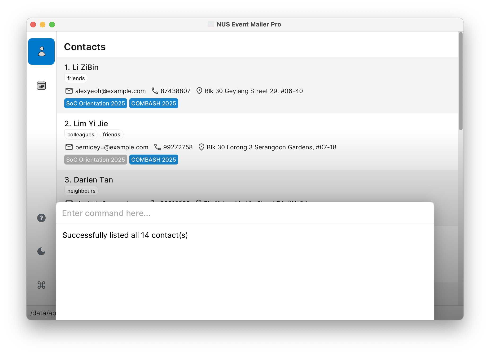

### 2.3 `contact edit`

**Update someone's details** when their information changes.

**How to do it:**

```
contact edit 1 --phone 98765432 --email newemail@gmail.com
```

This changes contact #1's phone and email.

**Important:** You can find the index of the contact in the displayed contact list. The index should be a positive number.

<box type="warning" seamless>

**Important to Know:**

- You can leave optional fields empty to clear them: `contact edit 1 --phone`
- Remove all tags with: `contact edit 1 --tag`
- Name and email can't be cleared (they're always needed)
- You must change at least one thing

</box>

**Format:**
<br />

```
contact edit INDEX [--name NAME] [--email EMAIL] [--phone PHONE] [--address ADDRESS] [--tag TAG]…
```

Screenshot Example:

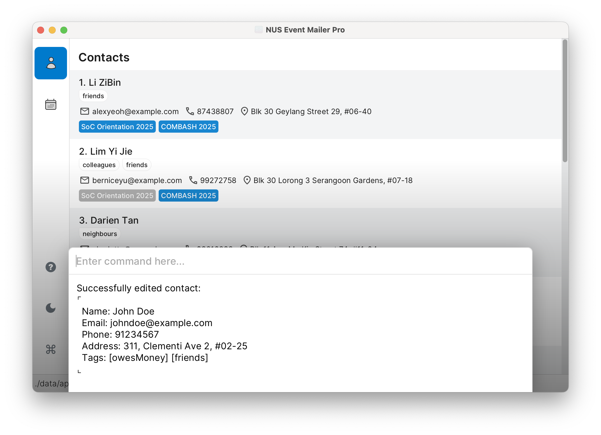

### 2.4 `contact find`

**Looking for someone specific?** You can search in different ways:

**Simple name search:**

```
contact find John
```

**Search by specific information:**

```
contact find --email gmail
contact find --phone 9123
contact find --address serangoon
contact find --tag friend
```

**Combine searches:**

```
contact find --name alice bob --email nus.edu ntu.edu
```

<box type="info" seamless>

<a id="how-search-works"><strong>How Search Works:</strong></a>

- **Doesn't matter** if you use capital or small letters
- **Partial matches work** (typing `gmail` finds `@gmail.com`)
- **Multiple words** in one field use OR logic
- **Different fields** use AND logic
- Perfect for finding everyone from the same company or area!

**Understanding Search Logic:**

**OR Logic (within one field):** Finds contacts matching **ANY** of the words

```
contact find --name alice bob
```

Finds contacts named alice **OR** bob

**AND Logic (between fields):** Finds contacts matching **ALL** the conditions

```
contact find --name alice --email gmail
```

Finds contacts named alice **AND** have gmail in their email

**Simple Example:**

```
contact find --name alice bob --email gmail
```

Finds: People named alice **OR** bob **AND** who have gmail in their email

</box>

<box type="tip" seamless>

**Note:** After using `contact find`, the displayed results will have their own index numbers (starting from 1). Use these index numbers when running commands on the found contacts.

</box>

**Format:**
<br />

```
contact find KEYWORD [MORE_KEYWORDS]... or contact find [--FIELD KEYWORD [MORE_KEYWORDS]...]...
```

Screenshot Example:

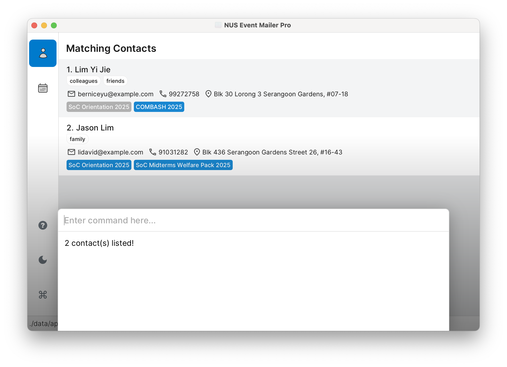

_In the example screenshot, `contact find --name lim` was executed._

### 2.5 `contact delete`

**Delete someone from your contacts:**

```
contact delete 3
```

This removes contact #3.

**Important:** You can find the index of the contact in the displayed contact list. The index should be a positive number .

<box type="warning" seamless>

**Be Careful!**

- **Double-check the number** before deleting
- This removes them from **all events** too
- **You can't undo this**, so make sure you want to delete!

</box>

**Format:**
<br />

```
contact delete INDEX
```

Screenshot Example:
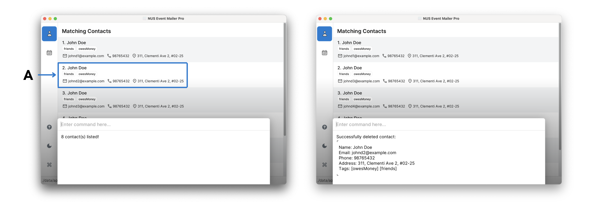
_In the example screenshot, `contact find --name john` was executed, and to delete the contact at index 2 (highlighted under A), `contact delete 2` was executed._

<!-- @@author CZX123 -->

### 2.6 `contact show`

**Check what events someone is invited to:**

```
contact show 2
```

Shows all events for contact #2.

**Important:** You can find the index of the contact in the displayed contact list. The index should be a positive number.

<box type="tip" seamless>

**Note:** The index numbers you see depend on whether you're looking at the full contact list or a filtered search result. After using `contact find`, use the index numbers from the search results.

</box>

<box type="tip" seamless>

**When This is Useful:**

- Remember what you invited someone to
- Check someone's event history
- Great for following up with people!

</box>

**Format:**
<br />

```
contact show INDEX
```

Screenshot Example:
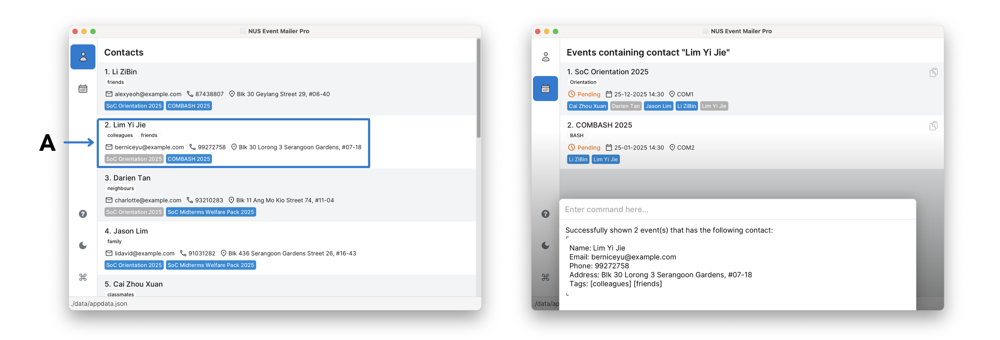
_In the example screenshot, we want to show all events for the contact at index 2 (highlighted under A), so we execute `contact show 2`, bringing us to the events page._

---

<!-- @@author reven0n -->

## 3. Managing Your Events

### 3.1 `event add`

**Plans a new event** and save all the details.

**Basic event:**

```
event add --name Team Meeting --date 25-12-2025 14:30
```

**You can add locations too:**

```
event add --name Company Party --date 31-12-2025 19:00 --address Office Lounge
```

<box type="tip" seamless>

**Event Tips:**

- **Date format:** DD-MM-YYYY HH:MM (24-hour time)
- **Address is optional** but helpful for location
- Events **do not** sort by date!
- **Event names must be unique** - no two events can have the same name
- For repeating events, include a date in the name (e.g., "Orientation 25/26" instead of just "Orientation")

</box>

**Format:**
<br />

```
event add --name NAME --date DATE [--address ADDRESS]
```

Screenshot Example:

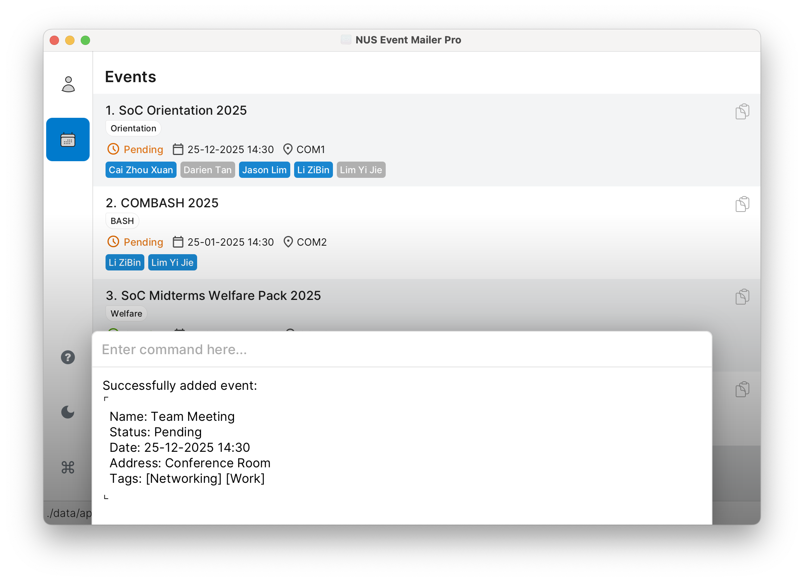

### 3.2 `event list`

**See all your planned events:**

```
event list
```

<box type="tip" seamless>

**👀 What You'll See:**

- Events with date, time, and location (if present)
- Each event has a **number** (save this for later!)
- Perfect for planning your schedule!

</box>

**Format:**
<br />

```
event list
```

Screenshot Example:

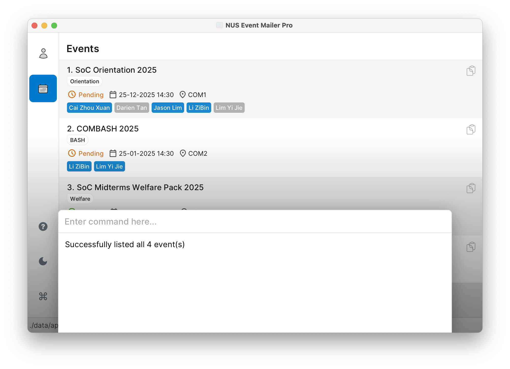

### 3.3 `event edit`

**Update event information** when plans change.

**How to do it:**

```
event edit 1 --name New Meeting Name --date 26-12-2025 15:00
```

This changes event #1's name and time.

**Important:** You can find the index of the event in the displayed event list. The index should be a positive integer.

<box type="tip" seamless>

**What You Can Change:**

- Event name (must remain unique across all events)
- Date and time
- Location/address
- Event status
  - **PENDING** - Event is planned/announced (default)
  - **ONGOING** - Event is currently in progress
  - **DONE** - Event has ended
- Tags (this will override the original tags!)
- **At least one thing must be updated**

</box>

**Format:**
<br />

```
event edit INDEX [--name NAME] [--date DATE] [--address ADDRESS] [--status STATUS] [--tag TAG]…
```

Screenshot Example:

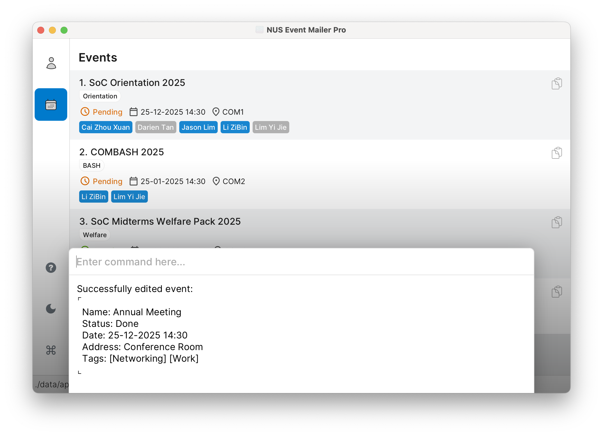

<!-- @@author -->

### 3.4 `event find`

**Looking for a specific event?** You can search in different ways:

**Simple name search:**

```
event find Meeting
```

**Search by specific information:**

```
event find --name Conference
event find --status pending
event find --date 25-12-2025 12:00
event find --address serangoon
event find --tag work
```

**Combine searches:**

```
event find --name meeting conference --tag work important
```

Event find works the same way as contact find (see [How Search Works](#how-search-works) for details).
<box type="info" seamless>
Event find specifics:

- Date searches look for exact matches (e.g. `25-12-2025 12:00` finds only that date and time)
- Only one date can be specified
- Status searches look for one of: `pending`, `ongoing`, `done`
  </box>

<box type="tip" seamless>

**Note:** After using `event find`, the displayed results will have their own index numbers (starting from 1). Use
these index numbers when running commands on the found events.

</box>

**Format:**
<br />

```
event find KEYWORD [MORE_KEYWORDS]... or event find [--FIELD KEYWORD [MORE_KEYWORDS]...]...
```

Screenshot Example:

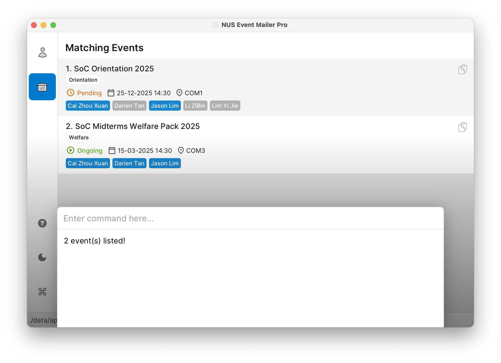

<!-- @@author reven0n -->

### 3.5 `event delete`

**Remove an event completely:**

```
event delete 2
```

This deletes event #2 and removes all contact connections.

**Important:** You can find the index of the event in the displayed event list. The index should be a positive number.

<box type="warning" seamless>

**Think Before You Delete!**

- **This can't be undone!**
- **All contacts will be removed** from this event
- Consider just removing specific people if you want to keep the event
- **Double-check the event number** before deleting

</box>

**Format:**
<br />

```
event delete INDEX
```

Screenshot Example:

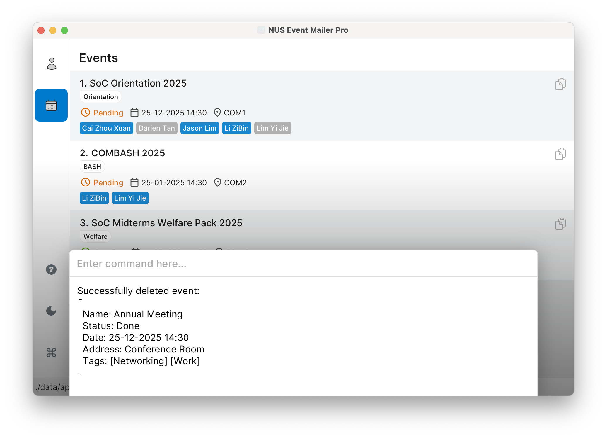

### 3.6 `event link`

**Add contacts to your event guest list:**

```
event link --event 1 --contact 2
```

This adds contact #2 to event #1.

**Add all listed contacts to an event**

You can also quickly invite everyone in your currently displayed contact list to an event:

```
event link --event 1 --contact listed
```

This adds **all contacts** from your currently displayed contact list to event #1 —
perfect for bulk invites or large gatherings.

**Important:**

- You can find the event index in the displayed event list
- You can find the contact index in the displayed contact list
- Both indexes should be a **positive** number, unless you use `listed` for `CONTACT_INDEX`
- Using `--contact listed` will link **every contact** displayed in the contact list to the specified event

<box type="tip" seamless>

**Inviting Tips:**

- First check event list and contact list for the right numbers
- One person can be in **multiple events**
- You can add the same contact to many events
- Perfect for building your guest list gradually!

</box>

**Format:**
<br />

```
event link --event EVENT_INDEX --contact CONTACT_INDEX
```

Screenshot Example:
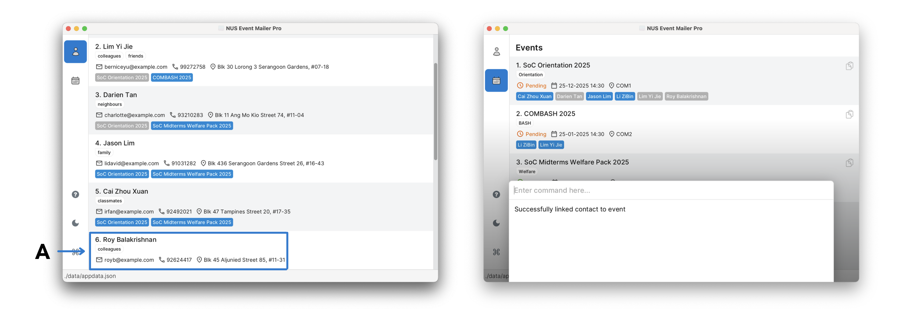
_In the example screenshot, we want to link the contact at index 6 (highlighted under A) to the event at index 1, so we execute `event link --event 1 --contact 6`._

### 3.7 `event unlink`

**Take someone off an event** when they can't make it:

```
event unlink --event 1 --contact 2
```

Removes contact #2 from event #1.

**Remove all listed contacts from an event**

You can also quickly clear your guest list for an event:

```
event unlink --event 1 --contact listed
```

This removes **all contacts** from your currently displayed contact list —
perfect for resetting or rebuilding your guest list.

**Important:**

- You can find the event index in the displayed event list
- You can find the contact index in the displayed contact list
- Both indexes should be a **positive** number, unless you use `listed` for `CONTACT_INDEX`
- Using `--contact listed` will unlink **every contact** displayed in the contact list from the specified event

<box type="tip" seamless>

**When to Use This:**

- Someone can't make it anymore
- The contact stays in your main contact list
- Only removes them from **this specific event**
- Great for managing last-minute changes!

</box>

**Format:**
<br />

```
event unlink --event EVENT_INDEX --contact CONTACT_INDEX
```

Screenshot Example:
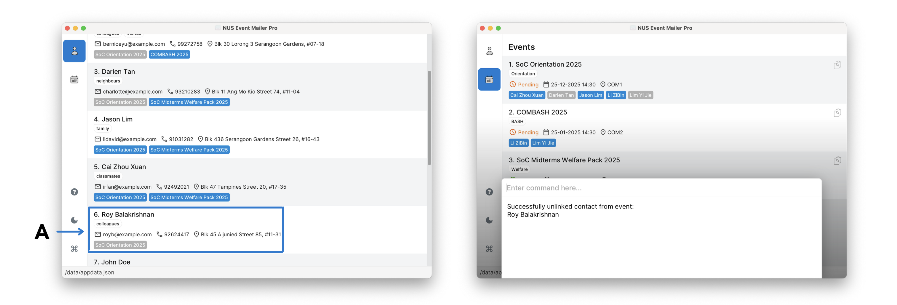
_In the example screenshot, we want to unlink the contact at index 6 (highlighted under A) to the event at index 1, so we execute `event unlink --event 1 --contact 6`._

<!-- @@author CZX123 -->

### 3.8 `event show`

**Check your guest list** for any event:

```
event show 1
```

Shows everyone invited to event #1.

**Important:** You can find the index of the event in the displayed event list. The index should be a positive number.

<box type="warning" seamless>

**Important Note About Index Numbers:**
The contact indexes shown in the event display are specific to this event's participant list. These indexes are different from the indexes in your main contact list.

</box>

<box type="tip" seamless>

**Why This is Helpful:**

- See contact details of everyone invited
- Know who to expect at your event
- Helps with planning seating, food, etc.
- Great for getting a quick overview!

</box>

**Format:**
<br />

```
event show INDEX
```

Screenshot Example:

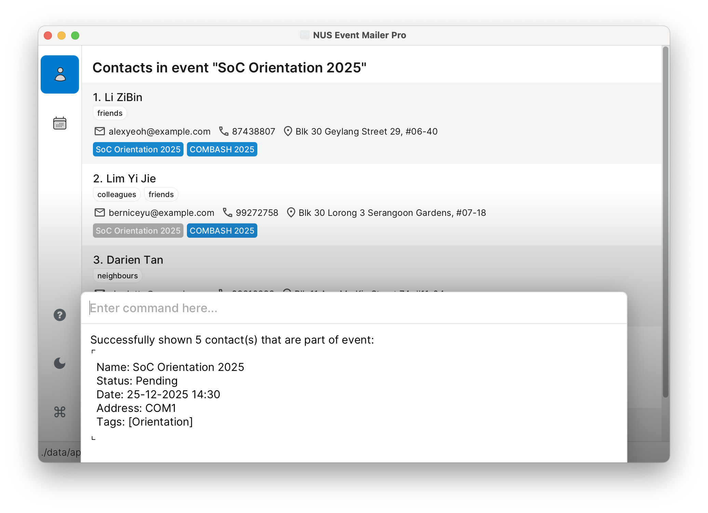

<!-- @@author -->

### 3.9 `event export`

**Quickly copy all contacts** with available status from an event to your clipboard. Or, if status is specified,
only copy contacts with that status:

```
event export 1 --status available
event export 1
```

Copies all contacts who are available from event #1.

**Important:** You can find the index of the event in the displayed event list. The index should be a positive number.

<box type="tip" seamless>

**Perfect For:**

- Pasting into emails or messages
- Sending reminders or updates
- Sharing contact information
- **You can also click the file icon** next to each event for quick export available contacts!
- Saves tons of time when sharing contact details

</box>

**Format:**
<br />

```
event export INDEX [--status STATUS]
```

Screenshot Example:

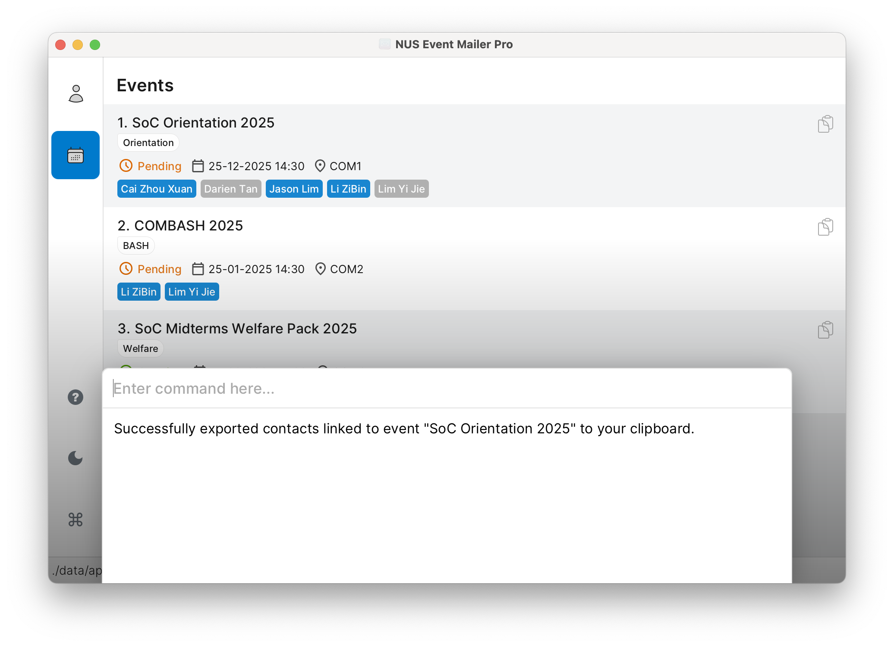

### 3.10 `event rsvp`

**Keep track of RSVP responses** as people reply:

```
event rsvp --event 1 --contact 2 --status available
```

Marks contact #2 as available for event #1.

<box type="info" seamless>

**Note:** The contact must already be linked to the event (using `event link`) before you can update their RSVP status. If the contact is not linked, you'll get an error message.

</box>

**Important:**

- You can find the event index in the displayed event list
- You can find the contact index in the displayed contact list
- Both indexes should be a **positive** number
- **The contact must already be linked to the event** using `event link` before you can update their RSVP status

**Possible responses:**

- `available` - They can make it!
- `unavailable` - They can't come
- `unknown` - Haven't decided yet

<box type="tip" seamless>

**RSVP Management Tips:**

- Update status as people respond to your invitations
- Helps with planning attendance and logistics
- Great for knowing who to expect at your events
- Perfect for managing large gatherings!

</box>

**Format:**
<br />

```
event rsvp --event EVENT_INDEX --contact CONTACT_INDEX --status STATUS
```

Screenshot Example:

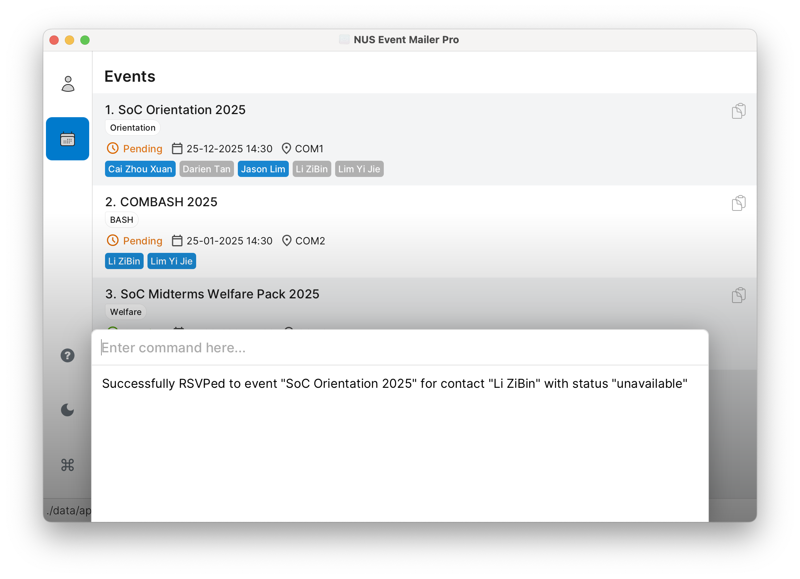

---

## 4. Your Data is Safe

### 4.1 Automatic Saving

**Good news!** The app saves everything automatically after each command. **No need to save manually** - you can just focus on planning your events!

### 4.2 Advanced: Editing Data Directly

Your information is saved in a file called `appdata.json` in the data folder. You can edit this file directly if you're comfortable with it.

<box type="warning" seamless>

**Warning for Advanced Users:**

- **Make a backup** before editing!
- If the format becomes invalid, the app will start with empty data
  - A file with the invalid format will be saved as `appdata.json.corrupt.<timestamp>` in the data folder
  - To view the contents this file, open the file with any editor file (e.g. Notepad, VSCode)
- Some edits might cause the app to behave strangely
- **Only edit if you're confident** you can do it correctly

</box>

---

## 5. Frequently Asked Questions

**Q: How do I move my data to another computer?**<br>
A: Install the app on the new computer and copy your old data file over the new empty one.

**Q: The app window disappeared! What do I do?**<br>
A: If you use multiple screens, try closing and reopening the app. If that doesn't work, delete the `preferences.json` file.

**Q: Can I edit the data file directly?**<br>
A: Yes, but be very careful! Always make a backup first. See the warning above.

---

## 6. Known Issues

1. **Multiple screens:** If you move the app to a second screen and then use only one screen, the app might open off-screen. Delete `preferences.json` to fix this.

2. **Help window:** If you minimize the help window and press `help` again, it might stay minimized. Just restore it manually.

---

## 7. Quick Command Reference

### 7.1 Basic Commands

| Action       | Format |
| ------------ | ------ |
| **Get Help** | `help` |
| **Exit App** | `exit` |

### 7.2 Contact Commands

| Action                    | Format, Examples                                                                                                                                                                                                        |
| ------------------------- | ----------------------------------------------------------------------------------------------------------------------------------------------------------------------------------------------------------------------- |
| **Add Contact**           | `contact add --name NAME --email EMAIL [--phone PHONE] [--address ADDRESS] [--tag TAG]…`<br>e.g. `contact add --name James --email james@e.com --phone 91234567 --address 123 Main Street --tag friend --tag colleague` |
| **Delete Contact**        | `contact delete INDEX`<br>e.g. `contact delete 3`                                                                                                                                                                       |
| **Edit Contact**          | `contact edit INDEX [--name NAME] [--email EMAIL] [--phone PHONE] [--address ADDRESS] [--tag TAG]…`<br>e.g. `contact edit 2 --name James --email jameslee@e.com`                                                        |
| **Find Contacts**         | `contact find KEYWORD [MORE_KEYWORDS]...` or `contact find [--FIELD KEYWORD [MORE_KEYWORDS]...]...`<br>e.g. `contact find --email gmail`<br>e.g. `contact find --phone 9123`                                            |
| **List Contacts**         | `contact list`                                                                                                                                                                                                          |
| **Show Contact's Events** | `contact show INDEX`<br>e.g. `contact show 1`                                                                                                                                                                           |

### 7.3 Event Commands

| Action                                    | Format, Examples                                                                                                                            |
| ----------------------------------------- | ------------------------------------------------------------------------------------------------------------------------------------------- |
| **Add Event**                             | `event add --name NAME --date DATE [--address ADDRESS]`<br>e.g. `event add --name Meeting --date 25-12-2025 14:30 --address Room 4`         |
| **Delete Event**                          | `event delete INDEX`<br>e.g. `event delete 2`                                                                                               |
| **Edit Event**                            | `event edit INDEX [--name NAME] [--date DATE] [--address ADDRESS] [--status STATUS] [--tag TAG]…`<br>e.g. `event edit 1 --name New Meeting` |
| **Find Event**                            | `event find KEYWORDS [MORE_KEYWORDS]...` or <br>e.g. `event find --name Conference` <br> `event find --status pending` <br/>                |
| **List Events**                           | `event list`                                                                                                                                |
| **Link Contact to Event**                 | `event link --event EVENT_INDEX --contact CONTACT_INDEX`<br>e.g. `event link --event 1 --contact 2`                                         |
| **Link All Listed Contacts to Event**     | `event link --event EVENT_INDEX --contact listed`<br>e.g. `event link --event 1 --contact listed`                                           |
| **Unlink Contact from Event**             | `event unlink --event EVENT_INDEX --contact CONTACT_INDEX`<br>e.g. `event unlink --event 1 --contact 2`                                     |
| **Unlink All Listed Contacts from Event** | `event unlink --event EVENT_INDEX --contact listed`<br>e.g. `event unlink --event 1 --contact listed`                                       |
| **Show Event's Contacts**                 | `event show INDEX`<br>e.g. `event show 1`                                                                                                   |
| **Export Event Contacts**                 | `event export INDEX [--status STATUS]`<br>e.g. `event export 1`<br> `event export 1 --status available`<br/>                                |
| **RSVP to Event**                         | `event rsvp --event EVENT_INDEX --contact CONTACT_INDEX --status STATUS`<br>e.g. `event rsvp --event 1 --contact 2 --status available`      |

---

## 8. You're All Set!

Congratulations! You now know everything about using NUS Event Mailer Pro.

**Remember:**

- Type `help` anytime you need a reminder
- Your data saves automatically

**Happy event planning!**

---

## 9. Coming soon...

In our development roadmap, we plan to implement:

- Import and export options for contacts and events (CSV, Excel)
- Automated email invitations with personalized greetings
- Calendar integration (Google Calendar, Outlook)
- Web application for easier access and on-the-go management

**Look forward to it!**

---

_Having trouble? Check our FAQ section above or type `help` in the app!_
